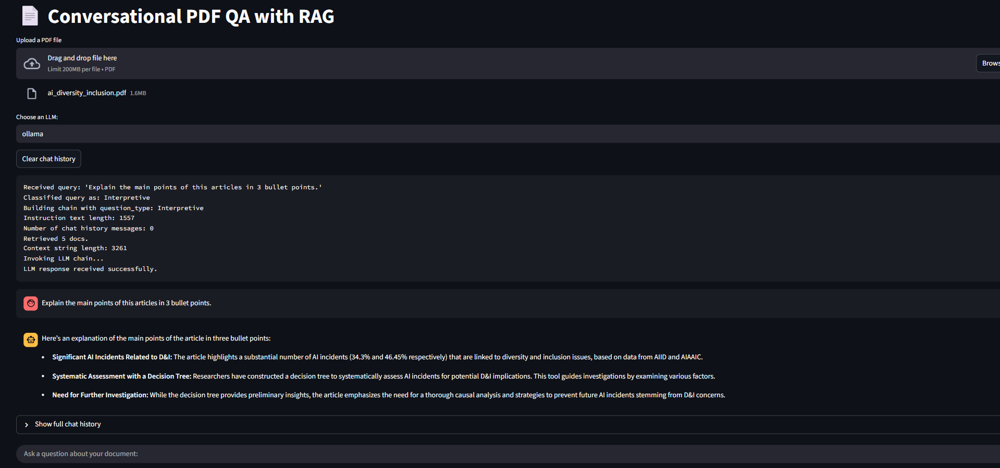
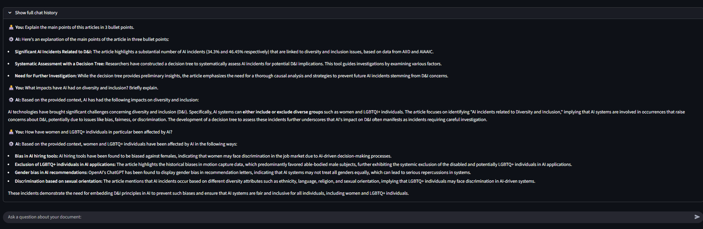

# **Streamlit-Powered Chatbot for PDF File Analysis**

This is a Python-powered application that allows users to upload a PDF file of their choice, ask questions about it, and get relevant answers, while engaging in a natural back and forth conversation with the chatbot.

## Features

Retrieval-Augmented Generation (RAG):
- A modular `RAG` pipeline was implemented using LangChain (an open-source framework used to simplify the process of creating LLM-powered applications) to answer questions about whatever PDF file the user uploads. This is done by retrieving relevant content based on the user query and passing it to the LLM along with the prompt as additional context.

Dynamic LLM selection:
- The Streamlit application allows the user to dynamically choose between 3 different LLM backends. These include a local `Ollama`-based model (Gemma-3), a general cloud API model using `Google Gemini` (Flash-2.5), and a fast cloud API model via `Groq` (Llama-3).

Chat History
- The user also has the ability to see the entire chat history in the UI over the duration of a particular session. Note that chat history is not preserved across multiple sessions.

## Folder Structure

This project includes the following:

### `screenshots/`

Contains screenshots of the Streamlit UI created for the chatbot, where a series of questions pertaining to a specific PDF article about AI diversity and inclusion were asked. The screenshots show the AI responses for different questions being asked using different LLMs as the backend. In addition, the overall chat history of all of the previous questions and answers can also be seen, by toggling on/off a switch called *"Show full chat history"* in the UI.

### `sample_documents/`

Contains two sample PDF files used for testing the Streamlit web application and the overall chatbot interaction in terms of asking various questions about the document's content. That being said, the user is free to upload their own PDF files for asking questions and interacting with the chatbot.

### `scripts/`

Contains Python scripts to build and use the RAG system built for context retrieval for question-answering purposes. The overall logic is broken into several scripts for modularity, and includes files for setting configurations, file processing, utility functions, building the RAG system, and a main file called `app.py` for running the entire pipeline, from loading the Ollama/Gemini/Groq LLM models and document chunking/embedding, to creating different prompt templates for the LLM to use, to building the RAG pipeline, to finally allowing the user to ask specific questions based on the collected data used and get answers, all within the Streamlit web application.

**To run the overall pipeline:**

- Run `streamlit run scripts/app.py` in the terminal. 
- This will open the Streamlit web application in a new browser tab, where the user is prompted to upload a PDF file of their choice. In addition, the user will also have the option to choose a specific LLM backend to use for question answering (default is Ollama)

- Below is an example of what the Streamlit UI for the chatbot looks like:

- And here is an example of the entire chat history being shown over the course of a single session:

- To see additional examples of what the Streamlit UI looks like without running the code, refer to the `screenshots` folder mentioned earlier.

**Disclaimer**: The local RAG system that was built, while effective with more specific question answering tasks, is not really well-suited at the moment for summarizing large bodies of text or entire documents/files. Trying to summarize an entire document or large body of text may yield poor or unexpected results.

### `requirements.txt`

Lists all required Python packages. Install with `pip install -r requirements.txt`.

## Configuration

When running this code on your own device, `config.py` can be modified as follows:

- Set paths for `DOCUMENTS_FOLDER`, `VECTOR_DB_DIR`, etc.
- Set API keys and other environment variables needed for utilizing the LLMs of choice.
- Configure `chunk_size` and `chunk_overlap`. 
    - These are used to control how big/how many chunks the uploaded PDF file is broken up into for the RAG pipeline.
- Customize instruction templates and base prompt used for question answering.

## Additional Notes:

The links to the sample PDF documents used for testing/interacting with the chatbot can be found below:

https://www.jair.org/index.php/jair/article/view/17806

https://www.jair.org/index.php/jair/article/view/15315
